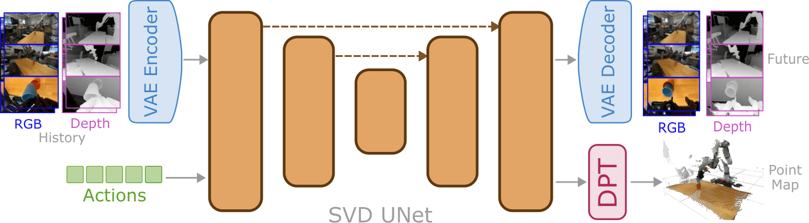
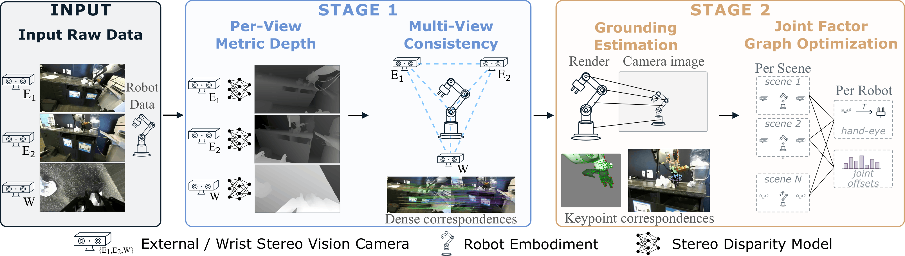

# DepthWorld: 3D World Model for Robot Manipulation

[](https://jaibardhan.com/depthworld/)
[](https://huggingface.co/jaibrdhn/depthworld)
[](https://jaibardhan.com/depthworld/)

Action-conditioned RGB+depth video world model for DROID-style robot
manipulation, built on Stable Video Diffusion. Given a short history of
multi-view RGB+depth latents and an action chunk, the model predicts future
RGB+depth latents; an optional DPT head additionally regresses per-pixel
world-frame point maps.



Two models are supported:

- **Horiz** — RGB and depth are packed side-by-side along width
  (`width=640`: left half RGB, right half depth-as-grayscale) per view,
  views stacked along height, and modeled by a single SVD UNet
  (`CrtlWorld`). One latent tensor `(T, 4, V*H_lat, 2*W_lat)` carries both
  modalities.
- **Horiz + DPT pointmap head** — the same model plus an auxiliary
  `DPTPointMapDecoder` (`CrtlWorldPointmap`). The head reads the predicted
  x0 latents (per-view RGB+depth halves, channel-concatenated to 8
  channels), decodes them through a four-scale DPT pyramid to full per-view
  resolution, and predicts world-frame XYZ + confidence. It is trained with
  a MapAnything-style robust confidence-weighted loss against point maps
  unprojected from raw stereo disparity, and can be warm-started from
  VGGT's point head.

## Layout

```
config.py                       wm_args dataclass — all defaults
accelerate_fsdp_nowrap.yaml     FSDP accelerate config used for horiz training
accelerate_ddp.yaml             DDP alternative
models/
  ctrl_world.py                 CrtlWorld: SVD UNet + action encoder
  ctrl_world_pointmap.py        CrtlWorldPointmap: + DPT pointmap aux loss
  pointmap_decoder.py           DPTPointMapDecoder (VGGT warm-start)
  unet_spatio_temporal_condition.py, pipeline_ctrl_world.py,
  pipeline_stable_video_diffusion.py, ema.py
dataset/
  dataset_droid.py            Dataset_mix (RGB) / Dataset_mix_dual (+ depth)
                              / Dataset_mix_horiz (RGB|depth packed on width)
  dataset_droid_pointmap.py   Dataset_mix_horiz_with_pointmap (+ world-frame
                              pointmap GT from raw disparity + calibration)
depth_extras/                   disparity → depth → world-XYZ pipeline
dataset_example/
  extract_latent_droid_raw.py   RGB + depth SVD-latent extraction from the
                                raw DROID tree (+ per-episode annotations)
  export_disparity_lo.py        raw downsampled disparity export (pointmap GT)
dataset_meta_info/
  create_meta_info.py           builds {train,val}_sample.json + stat.json
scripts/
  build_droid_raw_index.py      raw DROID tree -> raw_index.jsonl
  train_wm.py                   shared trainer (FSDP, EMA, warm-start, resume)
  train_wm_horiz_pointmap.py    entrypoint: horiz (+ optional DPT pointmap head)
  eval_horiz_utils.py           shared eval helpers (model build, metrics, decode)
  eval_horiz_chunk.py           single-chunk eval (RGB + depth + pointmap metrics)
  eval_horiz_rollout.py         closed-loop autoregressive rollout eval
  visualize_droid_3d.py         fuse an episode's views into a world-frame
                                point cloud (DROID-3D calibration reference)
  convert_dcp_to_single_pt.py /
  convert_ema_to_single_pt.py   FSDP DCP checkpoint → single .pt
checkpoints/                    pretrained backbones (see its README)
data/                           dataset root (see its README)
dataset_meta_info/              per-dataset index + stats (see its README)
depth_extras/meta/              camera calibration jsonl (see its README)
```

`checkpoints/`, `data/`, `dataset_meta_info/`, and `depth_extras/meta/` hold
large assets and ship empty except for a README describing the expected
contents.

## Setup

```bash
pip install -r requirements.txt
```

### Pretrained backbones (Hugging Face)

All external models are downloaded from Hugging Face:

```bash
pip install -U "huggingface_hub[cli]"
hf auth login   # SVD is gated: accept the license on its model page first

# SVD UNet + VAE + image encoder (required)
hf download stabilityai/stable-video-diffusion-img2vid \
    --local-dir checkpoints/stable-video-diffusion-img2vid
# CLIP text/image encoder for action conditioning (required)
hf download openai/clip-vit-base-patch32 \
    --local-dir checkpoints/clip-vit-base-patch32
# DPT pointmap-head warm-start (only needed for --pointmap_enabled training)
hf download facebook/VGGT-1B model.pt --local-dir checkpoints/vggt
```

### depthworld-trained checkpoints

Consolidated 90k-step EMA `.pt` checkpoints trained with this repo, hosted
at [jaibrdhn/depthworld](https://huggingface.co/jaibrdhn/depthworld)
(currently private — request access):

```bash
# horiz (RGB+depth, no pointmap head)
hf download jaibrdhn/depthworld horiz_90k_ema.pt config.json --local-dir checkpoints
# horiz + DPT pointmap head (VGGT init)
hf download jaibrdhn/depthworld horiz_dpt_vggt_90k_ema.pt config.json --local-dir checkpoints
```

### Asset locations

Populate the four asset folders (or point the corresponding flags/env vars
elsewhere):

| what | default location | override |
|---|---|---|
| SVD img2vid snapshot | `checkpoints/stable-video-diffusion-img2vid` | `CTRLWORLD_SVD_MODEL_PATH` / `--svd_model_path` |
| CLIP ViT-B/32 snapshot | `checkpoints/clip-vit-base-patch32` | `CTRLWORLD_CLIP_MODEL_PATH` / `--clip_model_path` |
| VGGT checkpoint | `checkpoints/vggt/model.pt` | `CTRLWORLD_VGGT_CKPT` / `--pointmap_vggt_ckpt` |
| dataset root | `data/` | `--dataset_root_path` |
| dataset meta info | `dataset_meta_info/` | `--dataset_meta_info_path` |
| calibration jsonl | `depth_extras/meta/` | `camera_*_path` dataset kwargs |

The calibration jsonls (optimized DROID-3D extrinsics + intrinsics) are
downloaded from
[jaibrdhn/droid_3d_extrinsics](https://huggingface.co/datasets/jaibrdhn/droid_3d_extrinsics)
— see [Data preparation](#data-preparation).

## Training

### Horiz (no pointmap head)

```bash
accelerate launch --config_file accelerate_fsdp_nowrap.yaml scripts/train_wm.py \
    --dataset_class rgb_depth_horiz --width 640 \
    --dataset_root_path data --dataset_meta_info_path dataset_meta_info \
    --dataset_names droid_raw_ctrl --dataset_cfgs droid_raw_ctrl \
    --no_ckpt --mixed_precision bf16 --use_ema \
    --train_batch_size 4 --max_train_steps 100000 \
    --tag horiz_base
```

### Horiz + DPT pointmap head

Warm-start the UNet from a consolidated horiz checkpoint, attach a
VGGT-initialized DPT head, and train with the pointmap aux loss:

```bash
CTRLWORLD_WARM_START_UNET_CKPT=checkpoints/horiz_40k_merged.pt \
CTRLWORLD_WARM_START_STEP=40000 \
accelerate launch --config_file accelerate_fsdp_nowrap.yaml \
    scripts/train_wm_horiz_pointmap.py \
    --pointmap_enabled --pointmap_dpt_init vggt \
    --pointmap_loss_weight 0.005 \
    --dataset_class rgb_depth_horiz --width 640 \
    --dataset_root_path data --dataset_meta_info_path dataset_meta_info \
    --dataset_names "" --dataset_cfgs droid_raw_ctrl \
    --no_ckpt --mixed_precision bf16 --use_ema \
    --train_batch_size 1 --max_train_steps 100000 \
    --tag horiz_pm_dpt_vggt
```

Notes:

- `--pointmap_dpt_init {random,vggt}` picks the head initialization; `vggt`
  copies VGGT's direct XYZ+confidence point head. The latent stem always
  trains from scratch.
- Pointmap training loads raw disparity (`disparity_lo/`) and calibration
  (`depth_extras/meta/`) to build world-frame XYZ ground truth on the fly.
- Without `--pointmap_enabled` the wrapper is equivalent to plain horiz
  training through `train_wm.py`.
- Auto-resume: each run checkpoints to `model_ckpt/<tag>/checkpoint-*`;
  relaunching with the same `--tag` resumes from the latest one.
- Joint-action conditioning is available via `--action_space
  joint_position` (8-D action instead of 7-D cartesian).

## Evaluation

The released checkpoints (see [Setup](#depthworld-trained-checkpoints)) are
already consolidated — pass them directly, e.g.
`--ckpt_path checkpoints/horiz_dpt_vggt_90k_ema.pt`. For your own training
runs, consolidate the FSDP checkpoint into a single `.pt` first:

```bash
python scripts/convert_dcp_to_single_pt.py \
    --input model_ckpt/<tag>/checkpoint-<step>/pytorch_model_fsdp_0 \
    --output model_ckpt/<tag>/checkpoint-<step>_merged.pt
# EMA weights:
python scripts/convert_ema_to_single_pt.py \
    --checkpoint_dir model_ckpt/<tag>/checkpoint-<step> \
    --output model_ckpt/<tag>/checkpoint-<step>_ema.pt
```

Single-chunk eval (one prediction step from GT history; RGB LPIPS/PSNR/SSIM,
metric-depth abs_rel/rmse/δ against the VAE-decoded depth target, pointmap
L1 / log-L1):

```bash
python scripts/eval_horiz_chunk.py \
    --ckpt_path model_ckpt/<tag>/checkpoint-<step>_merged.pt \
    --width 640 --dataset_root_path data \
    --dataset_meta_info_path dataset_meta_info --dataset_cfgs droid_raw_ctrl \
    --num_val_samples 30 --output_dir eval_results_chunk
```

Closed-loop autoregressive rollout eval (model-generated frames feed back as
visual history; per-frame metric curves):

```bash
python scripts/eval_horiz_rollout.py \
    --ckpt_path model_ckpt/<tag>/checkpoint-<step>_merged.pt \
    --width 640 --dataset_root_path data \
    --dataset_meta_info_path dataset_meta_info --dataset_cfgs droid_raw_ctrl \
    --interact_num 10 --num_val_samples 20 --output_dir eval_results_rollout
```

`build_horiz_model` inspects the checkpoint's state-dict and automatically
attaches a matching DPT pointmap head (base_ch / features are inferred), so
the same eval commands cover both the plain horiz and the horiz+DPT
checkpoints. When a pointmap head is present, its direct XYZ readout is
evaluated alongside the depth-unprojection pointmaps.

## Visualization

Fuse a ground-truth episode's three views into a single world-frame point
cloud using the DROID-3D calibration (requires `disparity_lo/`,
`annotation/`, and the calibration jsonls from Data preparation):

```bash
# PLY export (one file per frame, points colored per view)
python scripts/visualize_droid_3d.py --traj_id 100 --split val \
    --dataset_root data/droid_raw_ctrl --frames 0,10,20

# Interactive viewer with a frame slider (pip install viser; open :8090)
python scripts/visualize_droid_3d.py --traj_id 100 --split val \
    --dataset_root data/droid_raw_ctrl --viser
```

## Data preparation

The dataset is built from the raw DROID release (download per the official
DROID instructions, e.g. `gsutil -m cp -r gs://gresearch/robotics/droid_raw/1.0.1 ...`),
with precomputed S2M2 stereo disparity per camera placed next to each
episode's recordings (`recordings/s2m2_v2/<serial>/stereo_s2m2.npz`).

The optimized DROID-3D camera calibration (per-episode intrinsics +
factor-graph-optimized extrinsics, needed for pointmap training and
depth/pointmap eval) is hosted at
[jaibrdhn/droid_3d_extrinsics](https://huggingface.co/datasets/jaibrdhn/droid_3d_extrinsics):



```bash
hf download jaibrdhn/droid_3d_extrinsics --repo-type dataset \
    extrinsics.jsonl camera_intrinsics.jsonl --local-dir depth_extras/meta
```

`scripts/visualize_droid_3d.py` fuses an episode's three views into a single
world-frame point cloud using this calibration (PLY export or interactive
viser) — a minimal reference for consuming it.

1. **Index the raw tree** — one JSONL row per valid episode (camera serials,
   intrinsics/baseline, file paths, language annotations, train/val split):

   ```bash
   python scripts/build_droid_raw_index.py \
       --raw_root /path/to/droid_raw/1.0.1 \
       --output dataset_meta_info/droid_raw_ctrl/raw_index.jsonl
   ```

2. **Extract RGB + depth SVD latents** and per-episode annotation JSONs
   (shard across GPUs with `--num_workers N --worker_idx i`, one launch per
   process; already-complete episodes are skipped, so it is resumable):

   ```bash
   python dataset_example/extract_latent_droid_raw.py \
       --output_root data/droid_raw_ctrl \
       --svd_path checkpoints/stable-video-diffusion-img2vid
   ```

3. **Export raw disparity** — writes `disparity_lo/` (unclipped fp16
   disparity, needed for pointmap training and depth/pointmap eval; no VAE
   involved so this step needs no GPU):

   ```bash
   python dataset_example/export_disparity_lo.py \
       --output_root data/droid_raw_ctrl
   ```

4. **Build the clip index + action-normalization stats** — writes
   `dataset_meta_info/droid_raw_ctrl/{train,val}_sample.json` and
   `stat.json` (state 1%/99% percentiles from the train split):

   ```bash
   python dataset_meta_info/create_meta_info.py \
       --droid_output_path data/droid_raw_ctrl --dataset_name droid_raw_ctrl
   ```

See `data/README.md` for the expected on-disk layout and
`dataset_meta_info/README.md` for the index files the loaders consume.

## Citation

```bibtex
@inproceedings{bardhan2026depthworld,
  title     = {DepthWorld: 3D World Model for Robot Manipulation},
  author    = {Bardhan, Jai and \v{S}ivic, Josef and Petr\'{i}k, Vladim\'{i}r},
  booktitle = {ArXiv Preprint},
  year      = {2026}
}
```

## Acknowledgements

Built upon [Ctrl-World](https://github.com/Robert-gyj/Ctrl-World) and
[Stable Video Diffusion](https://github.com/Stability-AI/generative-models).
The pointmap head is warm-started from
[VGGT](https://github.com/facebookresearch/vggt) and trained with a loss
following [MapAnything](https://github.com/facebookresearch/map-anything).
Trained on the [DROID](https://droid-dataset.github.io/) dataset. The
gripper2wrist transformations (`depth_extras/assets/gripper2wrist_transforms.json`) 
is taken from [PointWorld](https://point-world.github.io/).

Code is released under the MIT license (`LICENSE.txt`). The released
checkpoints are fine-tuned from SVD and remain subject to the Stability AI
Community License; the DPT-head checkpoint was initialized from
facebook/VGGT-1B (CC-BY-NC 4.0) and is for non-commercial research use —
see the [Hugging Face model card](https://huggingface.co/jaibrdhn/depthworld)
for details.
